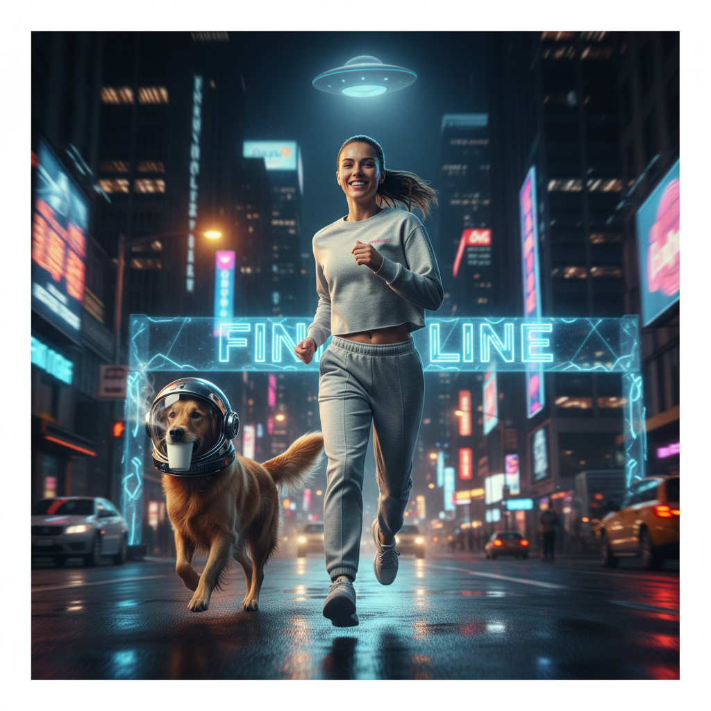
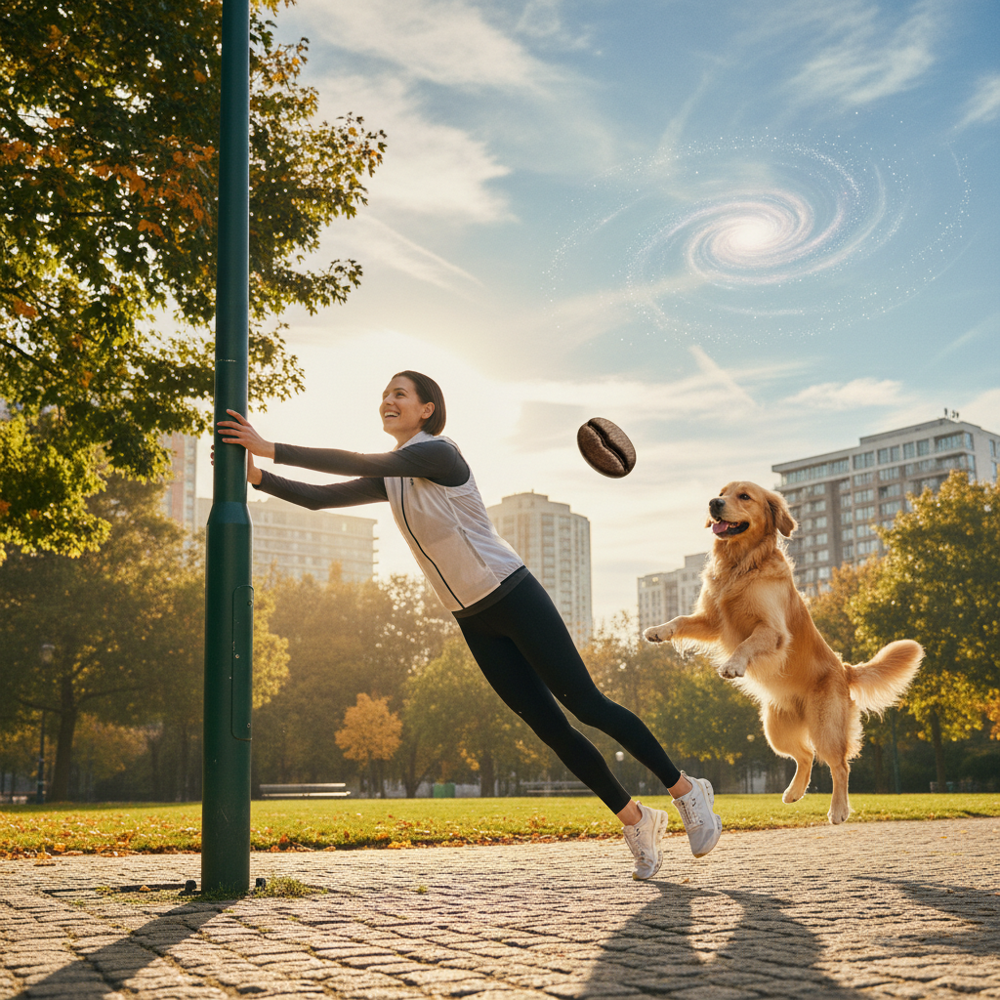
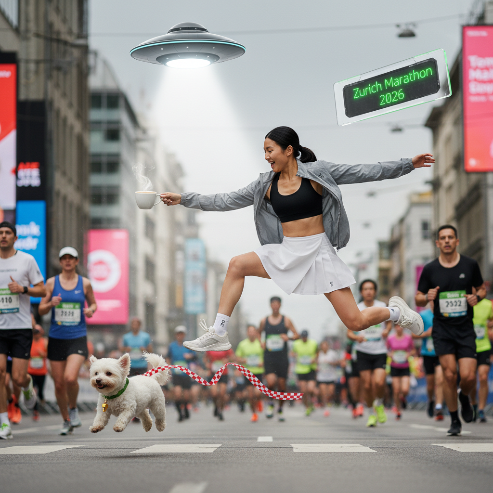
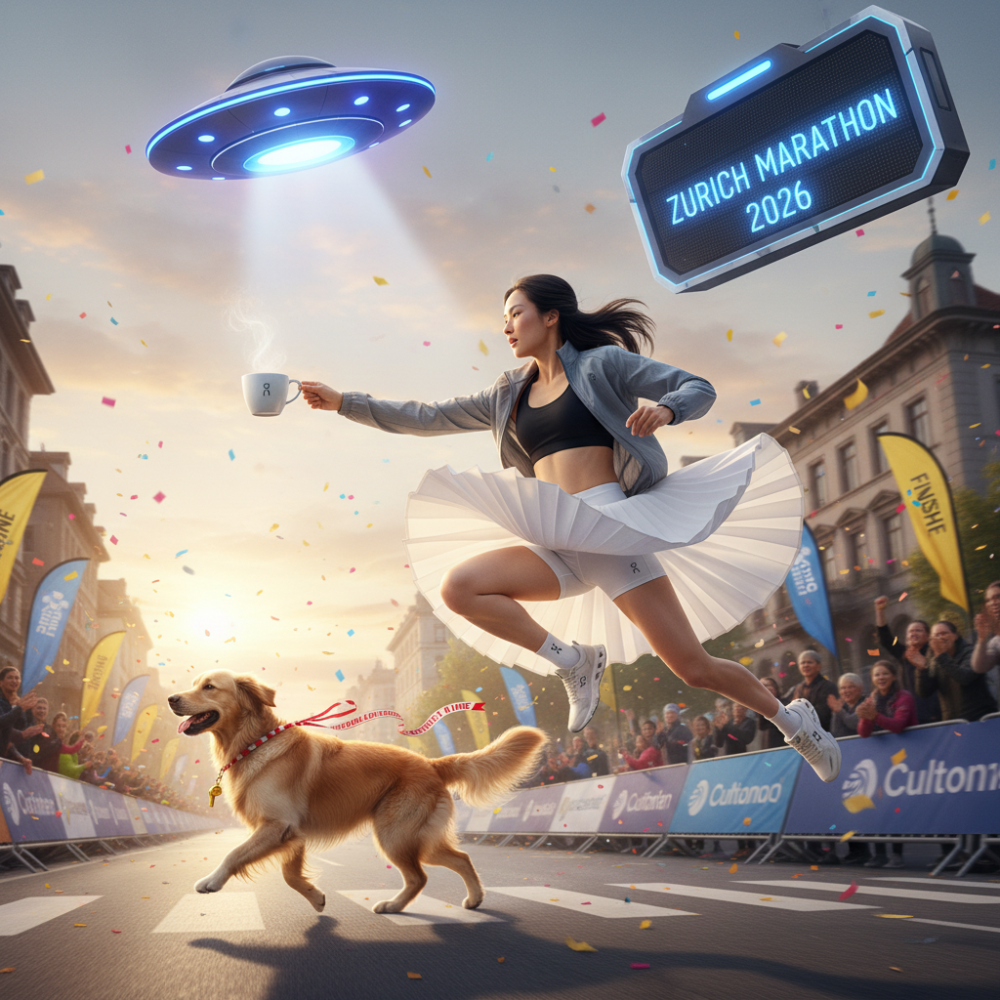

# On Marketing Assets Generator

Instagram post generator for the On brand, built with [Google ADK](https://google.github.io/adk-docs/).

`./data` folder contains all publicly available data from On online catalogue which can be used for assets generation.

> **Important:** To generate marketing assets, this project requires On's publicly available product catalog data placed in the `data/` folder at the project root. Without this data, the ideation agent cannot search for products and the pipeline will not produce results.

Two agents chain together via a JSON contract:

1. **Ideation Agent** — reads a mood board + searches the product catalog, outputs `ideas.json` with 3 post concepts
2. **Assets Generator Agent** — takes each idea, generates 3 image variations per idea (9 images total) using Gemini native image generation

## Quick start

```bash
# 1. Set your API key
cp .env.example .env
# Edit .env and add your GOOGLE_API_KEY

# 2. Install deps + build product index
make setup

# 3. Run the pipeline
make run
# or launch the web UI:
make web
```

## Commands

```
make help     Show all commands
make setup    Install dependencies and build product index
make index    Rebuild the product index from scraped data
make run      Run the agent pipeline in CLI mode
make web      Start the ADK web UI (browser-based)
make clean    Remove generated output files
```

## Usage

You can run the pipeline in two ways:

**CLI (non-interactive)** — pass a mood board file directly:

```bash
make run-file FILE=mood_boards/pants.md
```

**Interactive mode** — start the agent and tell it which mood board to use:

```bash
make run
# Then type: Generate Instagram posts from mood_boards/pants.md
```

The pipeline will:
1. Read the mood board
2. Search the product catalog for matching products
3. Generate 3 post ideas with real product data, saved to `output/ideas.json`
4. Generate 3 image variations per idea, saved as `output/<idea_id>_v<n>.png`

## Creating mood boards

Add markdown files to `mood_boards/`. Mood boards **must include product SKU references** so the ideation agent can look up the correct products from the catalog. See `mood_boards/pants.md` for an example.

Structure:

```markdown
# Campaign Name

Campaign description, creative direction, and any constraints.

The product SKUs: [1WE30701756, 1WD10570462, 1WF11290069]
```

## Sample generations

Below are example outputs from running the pipeline against the `mood_boards/pants.md` mood board.

### Ideas (output/ideas.json)

```json
{
  "mood_board_source": "mood_boards/pants.md",
  "generated_at": "2026-02-17T20:45:49.719354+00:00",
  "ideas": [
    {
      "id": "idea_1",
      "product_name": "Women's Weather Vest White | Black",
      "product_sku": "1WD10570462",
      "imagery_direction": "A bustling city street during a marathon, transformed into a 'street race' scene. Runners are nearing a 'finish line' that radiates an ethereal, otherworldly glow...",
      "headline": "Cross the Cosmos, Conquer the Finish Line.",
      "post_description": "Zurich Marathon 2026: It's more than a race, it's a journey to the stars...",
      "mood": "Triumphant, euphoric, dreamlike"
    },
    {
      "id": "idea_2",
      "product_name": "Women's Open Club Pants Crater",
      "product_sku": "1WE30701756",
      "imagery_direction": "An urban park or pedestrian area, depicting a relaxed 'life situation'. Runners are jogging effortlessly, exhibiting a state of partial weightlessness...",
      "headline": "Elevate Your Every Run. Literally.",
      "post_description": "Who said running had to be grounded? Experience the ultimate liberation on your next coffee run...",
      "mood": "Playful, liberating, serene yet whimsical"
    },
    {
      "id": "idea_3",
      "product_name": "Women's Open Club Pants Crater",
      "product_sku": "1WE30701756",
      "imagery_direction": "A quiet, atmospheric city street just before dawn, blending a 'life situation' with the anticipation of a 'street race'...",
      "headline": "Dawn of a New Dimension: Your Marathon Awaits.",
      "post_description": "Before the race, before the crowd, there's just you, the city, and a whisper from beyond...",
      "mood": "Intriguing, inspiring, calming, wonder-filled"
    }
  ]
}
```

### Generated images

**Idea 1** — "Cross the Cosmos, Conquer the Finish Line."



**Idea 2** — "Elevate Your Every Run. Literally."



**Idea 3** — "Dawn of a New Dimension: Your Marathon Awaits."

| Variation 1 | Variation 2 |
|---|---|
|  |  |

## Project structure

```
agents/
  agent.py              # Root SequentialAgent (entry point)
  ideation/agent.py     # Ideation agent (gemini-2.5-flash)
  ideation/tools.py     # read_mood_board, search_products, save_ideas
  assets_generator/     # Assets agent (gemini-2.5-flash-image)
  shared/schemas.py     # PostIdea / IdeasOutput Pydantic models
scripts/
  build_product_index.py  # Builds data/product_index.json from scraped data
mood_boards/              # Input mood board markdown files
output/                   # Generated ideas JSON + images
data/                     # Scraped product catalog (~17GB)
```
